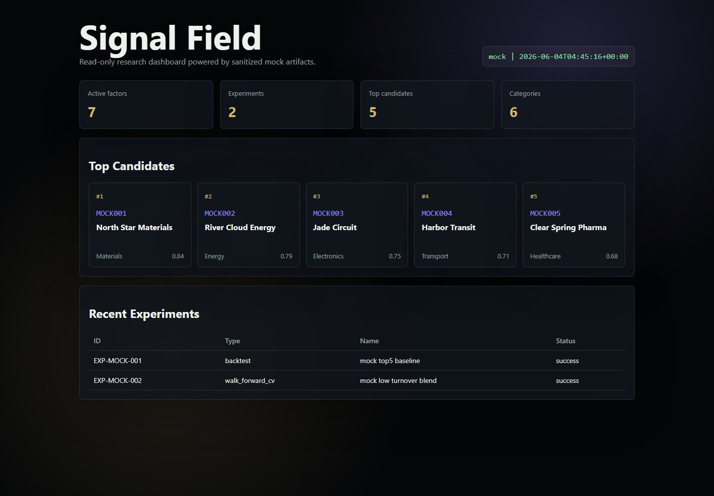

# OpenClaw A-Share Research Lab

[中文说明](README.zh-CN.md)

Private-safe, local-first scaffolding for an OpenClaw-powered A-share quant research workflow.

This repository is a sanitized extraction from a larger local research workspace. It keeps the reusable architecture and removes private data, live positions, local machine paths, messaging credentials, trading outputs, and production strategy files.



## What Is Included

- `registry`: factor metadata, experiment records, and research run manifests.
- `gladiator`: a small factor-combination arena for ranking candidate factor recipes.
- `dashboard_bridge`: a data bridge that turns mock research artifacts into dashboard JSON.
- `dashboard`: a static read-only signal field dashboard backed by mock data.
- `examples/mock_data`: small fake data used for demos and tests.

## What Is Not Included

- No live trading code.
- No account, position, or order data.
- No proprietary market data files.
- No hard-coded local data drive paths or OpenClaw runtime paths.
- No cookies, credentials, memory logs, or messaging integration state.

## Quick Start

```powershell
python -m venv .venv
.\.venv\Scripts\Activate.ps1
python -m pip install -e ".[dev]"
python scripts/build_demo.py
python -m pytest
```

Open the dashboard after building demo data:

```powershell
start dashboard\index.html
```

For the most reliable local preview, serve the repository over HTTP first:

```powershell
python -m http.server 8123
```

Then open `http://127.0.0.1:8123/dashboard/`.

## CLI Examples

Build a factor registry from mock data:

```powershell
python -m openclaw_a_share_research_lab.registry build --factors examples\mock_data\factors.csv --out data\factor_registry.json
```

Log an experiment:

```powershell
python -m openclaw_a_share_research_lab.registry log-experiment --manifest examples\mock_data\experiment_manifest.json --out data\experiments.jsonl
```

Run a small factor arena:

```powershell
python -m openclaw_a_share_research_lab.gladiator --factors examples\mock_data\factors.csv --out data\gladiator_rankings.json
```

Build dashboard data:

```powershell
python -m openclaw_a_share_research_lab.dashboard_bridge --mock-dir examples\mock_data --out dashboard\dashboard_data.json
```

## Safety Boundary

This is a research and visualization scaffold. It is not investment advice and does not place orders. Any production trading system should keep execution code, credentials, broker configuration, and private market data outside this repository.

## Repository Status

This first version is intentionally conservative: it is suitable as a private GitHub draft and can be made public after a manual review of generated files and naming.
